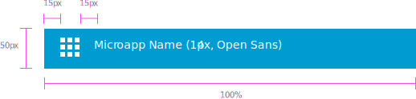
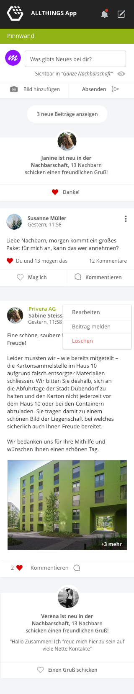
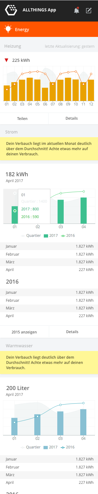
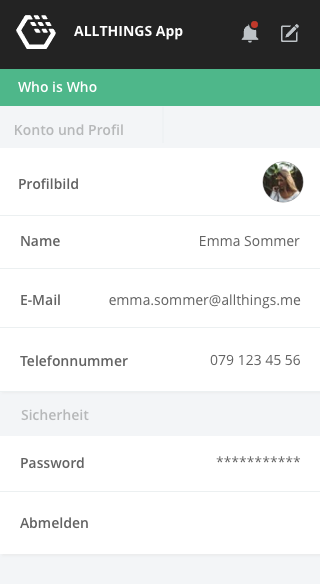

# MicroApp Components

## AppBar

Microapps should always come with an app bar.

## Fluid Layout

MircroApps should use a fluid layout to be compatible with smartphones and 
tablet and up to widescreen desktop monitors.

## Images

User and Profile Images are **always** completely round. All other images are 
rectangular.

## Example MicroApps

### Pinboard

### Who is who

### Energy Consumption

### Settings Page
